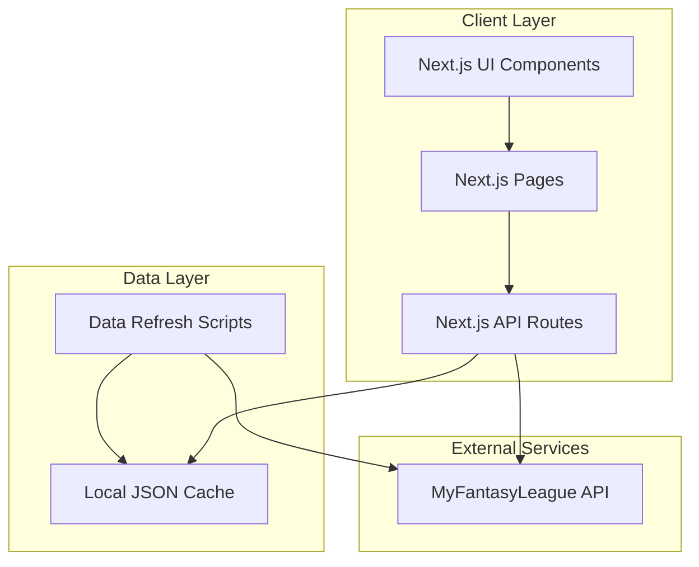

# Design Document

## Overview

The MFL UI Rewrite is a modern Next.js application that provides an enhanced user interface for MyFantasyLeague.com. The system follows a two-phase approach: Phase 1 implements local JSON caching for static data with scripts to populate the cache, and Phase 2 (future) will migrate to a proper database. The application uses the MFL API for all data operations while providing a significantly improved user experience.

## Architecture

### High-Level Architecture



### Technology Stack

- **Frontend Framework**: Next.js 14+ with App Router
- **Authentication**: Custom session management with MFL cookies
- **Data Storage**: Local JSON files (Phase 1), Database (Phase 2)
- **HTTP Client**: Fetch API with custom MFL API wrapper
- **UI Framework**: React with modern CSS or Tailwind CSS
- **TypeScript**: Full TypeScript implementation for type safety

## Components and Interfaces

### Core Components

#### 1. MFL API Client (`lib/mfl-api.ts`)
```typescript
interface MFLApiClient {
  // Authentication
  login(username: string, password: string): Promise<AuthResult>
  
  // Data fetching
  getLeagues(year?: number): Promise<League[]>
  getRosters(leagueId: string): Promise<Roster[]>
  getFreeAgents(leagueId: string): Promise<Player[]>
  getLiveScoring(leagueId: string, week: number): Promise<LiveScore[]>
  
  // Data modification
  setLineup(leagueId: string, week: number, starters: string[]): Promise<void>
}
```

#### 2. Data Cache Manager (`lib/cache-manager.ts`)
```typescript
interface CacheManager {
  getPlayers(): Promise<Player[]>
  getPlayerById(id: string): Promise<Player | null>
  refreshCache(): Promise<void>
  isCacheStale(): boolean
}
```

#### 3. Authentication Provider (`lib/auth-provider.tsx`)
```typescript
interface AuthContext {
  user: User | null
  login: (username: string, password: string) => Promise<void>
  logout: () => void
  isAuthenticated: boolean
}
```

### Page Components

#### 1. Login Page (`app/login/page.tsx`)
- Username/password form
- MFL authentication integration
- Session management
- Error handling for invalid credentials

#### 2. Dashboard (`app/dashboard/page.tsx`)
- League selection interface
- Quick navigation to key features
- User profile information

#### 3. League Overview (`app/league/[id]/page.tsx`)
- League information display
- Navigation to rosters, free agents, scoring
- Current week information

#### 4. Rosters Page (`app/league/[id]/rosters/page.tsx`)
- All team rosters display
- Player information with positions
- Sortable and filterable views

#### 5. Free Agents (`app/league/[id]/free-agents/page.tsx`)
- Available players list
- Position filtering
- Player statistics and availability status

#### 6. Lineup Management (`app/league/[id]/lineup/page.tsx`)
- Current roster with position requirements
- Drag-and-drop lineup setting
- Validation for position requirements
- Save functionality via MFL API

#### 7. Live Scoring (`app/league/[id]/scoring/page.tsx`)
- Real-time score updates
- Individual player performance
- Team totals and rankings
- Game status indicators

## Data Models

### Core Data Types

```typescript
interface Player {
  id: string
  name: string
  position: string
  team: string
  status?: 'active' | 'injured' | 'bye'
}

interface League {
  id: string
  name: string
  year: number
  host: string
  franchiseId?: string
}

interface Roster {
  franchiseId: string
  franchiseName: string
  players: RosterPlayer[]
}

interface RosterPlayer extends Player {
  status: 'starter' | 'bench' | 'ir' | 'taxi'
  salary?: number
}

interface LiveScore {
  playerId: string
  points: number
  gameStatus: 'not_started' | 'in_progress' | 'final'
  projectedPoints?: number
}

interface User {
  username: string
  cookie: string
  leagues: League[]
}
```

### Cache Data Structure

```
data/
├── players.json          # All player data
├── nfl-schedule.json     # NFL schedule data
├── nfl-teams.json        # NFL team information
└── scoring-rules.json    # Common scoring rules
```

## Data Refresh Scripts

### Script Architecture

#### 1. Main Refresh Script (`scripts/refresh-cache.js`)
- Orchestrates all data refresh operations
- Handles error recovery and logging
- Validates data integrity before saving

#### 2. Player Data Script (`scripts/fetch-players.js`)
- Fetches complete player database from MFL API
- Processes and formats player information
- Updates `data/players.json`

#### 3. NFL Data Script (`scripts/fetch-nfl-data.js`)
- Fetches NFL schedule and team information
- Updates schedule and team data files
- Handles current week detection

#### 4. Validation Script (`scripts/validate-cache.js`)
- Validates JSON file integrity
- Checks for required fields
- Reports data quality issues

### Script Usage

```bash
# Refresh all cached data
npm run refresh-cache

# Refresh specific data types
npm run refresh-players
npm run refresh-nfl

# Validate cache integrity
npm run validate-cache
```

## API Integration Patterns

### Authentication Flow

1. User submits credentials via login form
2. Next.js API route calls MFL login endpoint
3. MFL returns authentication cookie
4. Cookie stored securely in session
5. All subsequent API calls include authentication cookie

### Data Fetching Strategy

#### Static Data (Cached)
- Player database
- NFL schedule
- Scoring rules
- Served from local JSON files

#### Dynamic Data (Real-time)
- League rosters
- Free agents
- Live scoring
- Lineup changes
- Fetched directly from MFL API

### Error Handling

```typescript
interface APIError {
  code: 'AUTHENTICATION_FAILED' | 'RATE_LIMITED' | 'SERVER_ERROR' | 'NETWORK_ERROR'
  message: string
  retryAfter?: number
}
```

## Performance Considerations

### Caching Strategy
- Static data served from local JSON files
- API responses cached for appropriate durations
- Implement request deduplication for concurrent requests

### Rate Limiting Compliance
- Implement 1-second delays between API requests
- Use registered client user agent "MFLREWRITE"
- Handle 429 responses with exponential backoff

### Optimization Techniques
- Next.js static generation for cacheable pages
- Component-level code splitting
- Lazy loading for non-critical features
- Image optimization for team logos and player photos

## Security Considerations

### Authentication Security
- HTTPS-only for all authentication requests
- Secure session storage
- Automatic session expiration
- CSRF protection on forms

### API Security
- Input validation on all user inputs
- Sanitization of data before API calls
- Rate limiting on client-side requests
- Error message sanitization

## Error Handling Strategy

### Client-Side Error Handling
- Global error boundary for React components
- Toast notifications for user-facing errors
- Graceful degradation for missing data
- Retry mechanisms for transient failures

### API Error Handling
- Structured error responses
- Appropriate HTTP status codes
- Detailed logging for debugging
- User-friendly error messages

## Correctness Properties

*A property is a characteristic or behavior that should hold true across all valid executions of a system-essentially, a formal statement about what the system should do. Properties serve as the bridge between human-readable specifications and machine-verifiable correctness guarantees.*

### Property 1: Cache Data Consistency
*For any* request for cached data (players, NFL schedule, scoring rules), the system should serve data from local JSON files without making external API calls, and the data should be in the expected format.
**Validates: Requirements 1.2, 1.4**

### Property 2: API Request Format Compliance
*For any* API request to MFL services, the request should include the correct User-Agent header "MFLREWRITE", follow the URL format protocol://host/year/command?args, and include proper authentication cookies when required.
**Validates: Requirements 2.1, 2.2, 2.3, 3.5**

### Property 3: Authentication Flow Consistency
*For any* login attempt with valid credentials, the system should authenticate via MFL login API, store the authentication cookie securely, and display the user's leagues.
**Validates: Requirements 3.1, 3.2, 4.1**

### Property 4: Data Display Completeness
*For any* data display (leagues, rosters, free agents, scoring), all required fields should be present and properly formatted, including names, positions, stats, and status information.
**Validates: Requirements 4.2, 5.2, 6.2, 8.2**

### Property 5: Navigation Consistency
*For any* user interaction that should trigger navigation (league selection, page transitions), the system should navigate to the correct destination with proper state management.
**Validates: Requirements 4.3, 7.1**

### Property 6: Data Organization and Filtering
*For any* data list display (rosters, free agents), the system should organize data logically (by position) and support filtering operations that return only matching items.
**Validates: Requirements 5.4, 6.3**

### Property 7: Lineup Validation
*For any* lineup modification attempt, the system should validate position eligibility and prevent invalid configurations, ensuring all position requirements are met.
**Validates: Requirements 7.2, 7.4**

### Property 8: Data Persistence
*For any* data modification operation (lineup changes, trade proposals), the system should save changes via the appropriate MFL import API and confirm successful persistence.
**Validates: Requirements 7.3**

### Property 9: Real-time Data Updates
*For any* live data display (scoring, game status), the system should automatically refresh data without user intervention and indicate current player/game status.
**Validates: Requirements 8.1, 8.3, 8.4**

### Property 10: Error Handling Gracefully
*For any* error condition (authentication failure, API unavailability, missing data), the system should display appropriate error messages, preserve existing functionality where possible, and provide recovery options.
**Validates: Requirements 2.4, 3.3, 4.5, 5.5, 7.5, 8.5**

### Property 11: Cache Management
*For any* cache update operation, the system should preserve the existing file structure, validate data integrity before saving, and handle failures without corrupting existing cache.
**Validates: Requirements 1.5, 10.2, 10.3, 10.5**

### Property 12: Multi-host League Support
*For any* league across different MFL hosts, the system should correctly identify the host, route requests appropriately, and maintain consistent functionality regardless of host.
**Validates: Requirements 4.4**

## Testing Strategy

The application will use a dual testing approach combining unit tests for specific functionality and property-based tests for universal correctness properties.

### Unit Testing
Unit tests will focus on specific examples, edge cases, and integration points:
- Component rendering and interaction tests
- Authentication flow with specific credentials
- Data transformation edge cases
- Error handling scenarios
- Script execution and file operations
- Next.js framework integration points

### Property-Based Testing
Property-based tests will validate universal properties across all inputs using a minimum of 100 iterations per test. Each test will be tagged with the format: **Feature: mfl-ui-rewrite, Property {number}: {property_text}**

**Testing Framework**: Jest with fast-check for property-based testing
**Configuration**: Minimum 100 iterations per property test
**Coverage**: Each correctness property must be implemented by a single property-based test

## Future Considerations (Phase 2)

### Database Migration
- Replace JSON files with proper database (PostgreSQL/MongoDB)
- Implement data synchronization strategies
- Add data versioning and conflict resolution

### Advanced Features
- Push notifications for score updates
- Advanced analytics and statistics
- Mobile app development
- Real-time collaboration features

### Scalability Improvements
- CDN integration for static assets
- Database query optimization
- Caching layer improvements
- Load balancing considerations